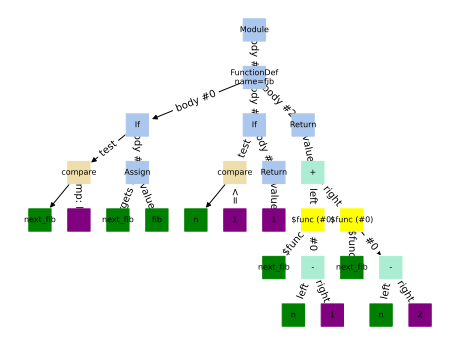

# 💫 Beautiful AST 💫

Use `main.py` to visualize python code

## To visualize code from file 👀

```shell
$ ./visualize.py examples/fib_naive.py
```

## To visualize code from `stdin` ✍️

```shell
$ ./main.py
a += 1
```

Terminate the input after (type `Ctrl+D` or similar command in your shell)

## More 😱

To get more out your `visualize.py` experience,
just add `-h` flag to get more exhaustive instructions.

```shell
$ ./src/visualize.py
usage: ./src/visualize.py [-h] [--output OUTPUT] [--with-traceback] [--no-show] [file]

Python code visualizer

positional arguments:
  file              Specify path to the sources fileIf no path is specified, stdin will be used

optional arguments:
  -h, --help        show this help message and exit
  --output OUTPUT   Specify output filename to store graph.Graph only will be shown by default
  --with-traceback  Print error with traceback
  --no-show         Do not show graph
```

## Example 🖼️

```shell
./main.py examples/fib_naive.py --no-show --output artifacts/fib_naive.svg
```


