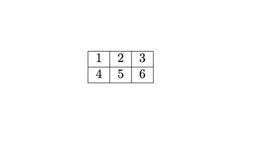
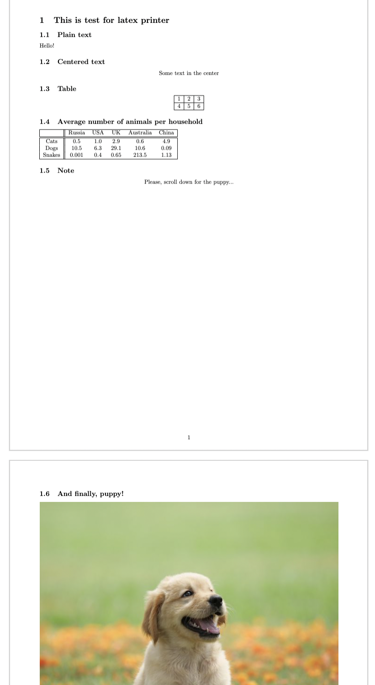

# $\LaTeX$ Generator

All artifacts can be generated with [`main.py`](main.py)

```shell
$ ./main.py -h

usage: LaTeX Generator [-h] {table,ast,advanced} output

positional arguments:
  {table,ast,advanced}
  output

optional arguments:
  -h, --help            show this help message and exit
```

## Examples 🤪

### Simple spreadsheet 📋

To generate sample spreadsheet

```shell
$ ./main.py table artifacts/table.tex
```




### Image insertion 📷

To generate sample tex with ast

```shell
$ ./main.py ast artifacts/ast.tex
```


### Demo 🤯

To generate more advanced tex example

```shell
$ ./main.py advanced artifacts/advanced.tex
```


